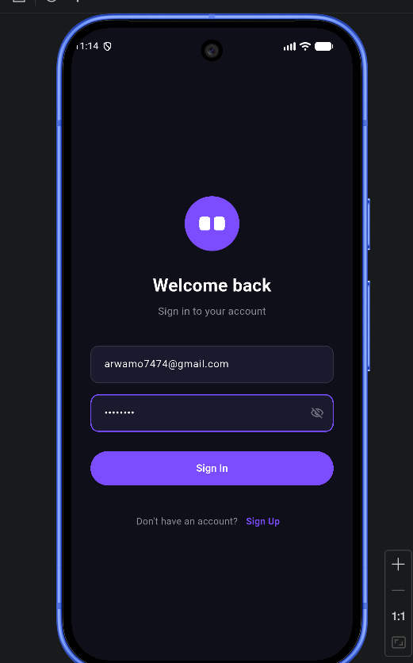
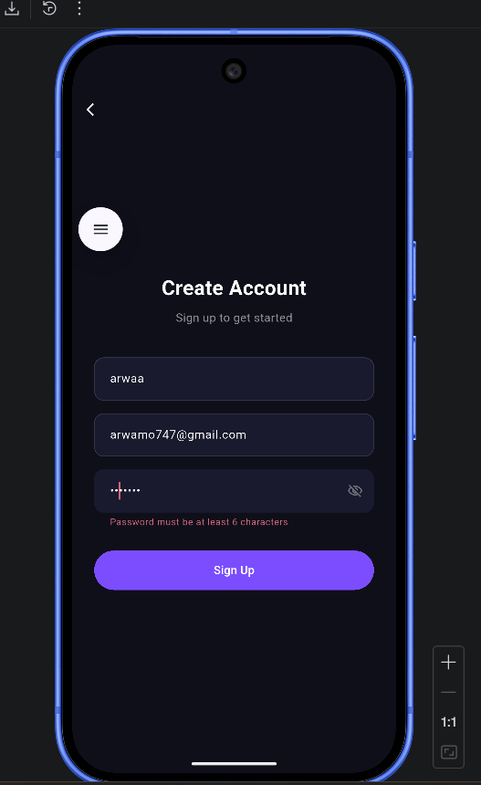

# Task Manager

A Flutter application for managing tasks, built with Clean Architecture and BLoC state management.

---

## Setup Steps

### Prerequisites

Make sure the following are installed on your machine:

- [Flutter SDK](https://docs.flutter.dev/get-started/install) `^3.11.4`
- Dart SDK (comes bundled with Flutter)
- Android Studio / Xcode (for emulator/simulator) or a physical device
- A running backend REST API server

### 1. Clone the repository

```bash
git clone <repository-url>
cd task_manager
```

### 2. Install dependencies

```bash
flutter pub get
```

### 3. Configure the API base URL

Open [lib/core/app_constants.dart](lib/core/app_constants.dart) and update `baseUrl` to point to your backend server (see [API Configuration](#api-configuration) below).

---

## How to Run the App

### Run on an emulator or connected device

```bash
flutter run
```

### Run on a specific platform

```bash
# Android
flutter run -d android

# iOS
flutter run -d ios

# Web
flutter run -d chrome
```

### Build a release APK

```bash
flutter build apk --release
```

---

## API Configuration

The base URL and all API endpoints are defined in [lib/core/app_constants.dart](lib/core/app_constants.dart):

```dart
class AppConstants {
  static const String baseUrl = 'http://192.168.1.14:3000';

  static const String loginEndpoint    = '/login';
  static const String registerEndpoint = '/register';
  static const String tasksEndpoint    = '/tasks';
}
```

### Changing the base URL

Update `baseUrl` depending on where you are running the app:

| Target device        | Value to use                        |
|----------------------|-------------------------------------|
| Android Emulator     | `http://10.0.2.2:<port>`            |
| iOS Simulator        | `http://localhost:<port>`           |
| Physical device      | `http://<your-PC-local-IP>:<port>`  |

To find your PC's local IP on Windows, run `ipconfig` in the terminal and look for **IPv4 Address**.

### API Endpoints

| Method | Endpoint       | Description          |
|--------|----------------|----------------------|
| POST   | `/register`    | Register a new user  |
| POST   | `/login`       | Login and get token  |
| GET    | `/tasks`       | Fetch all tasks      |
| GET    | `/tasks/:id`   | Fetch a single task  |
| POST   | `/tasks`       | Create a new task    |
| PUT    | `/tasks/:id`   | Update a task        |
| DELETE | `/tasks/:id`   | Delete a task        |

### Authentication

After a successful login or registration, the token returned by the server is persisted locally using `flutter_secure_storage` and automatically attached to subsequent API requests.

---

## Screenshots

| Login | Registration |
|-------|-------------|
|  |  |

| List of Tasks | Create Task |
|---------------|-------------|
|  |  |

| Task Details | Edit Task |
|--------------|-----------|
|  |  |

| Delete Task | After Delete |
|-------------|--------------|
|  |  |

---

## Dependencies

| Package                  | Purpose                        |
|--------------------------|--------------------------------|
| `flutter_bloc`           | State management (BLoC)        |
| `get_it`                 | Dependency injection           |
| `dio`                    | HTTP client                    |
| `flutter_secure_storage` | Secure token storage           |

